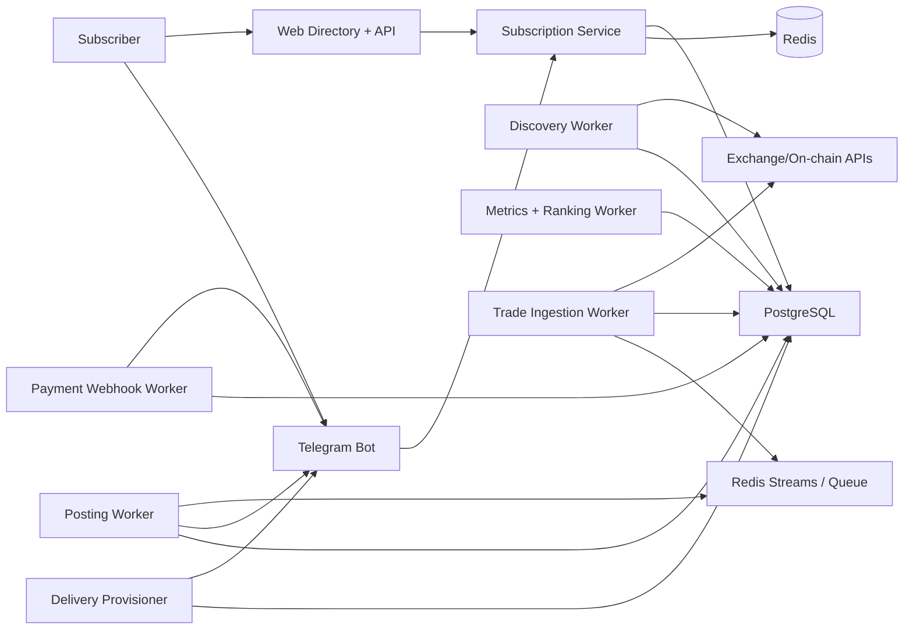

# Production Architecture (Ubuntu)

Last updated: 2026-03-07

## 1. Goal
Побудувати безвідмовну систему, яка автоматично:
1. знаходить активних ф'ючерсних трейдерів;
2. рахує метрики якості;
3. показує каталог трейдерів для підписників;
4. приймає оплату підписки;
5. підключає користувача до персонального delivery-каналу;
6. постить трейди вибраних трейдерів без ручного втручання.

## 2. Reality Check (Telegram API)
- Bot API не має методу `createChat`/`createChannel` для бота.
- Для каналів є `createChatSubscriptionInviteLink` (платний інвайт), з періодом підписки `2592000` секунд (30 днів).
- Для digital goods у Telegram слід використовувати Telegram Stars (XTR).

Висновок: модель "рівно 1 USD/день автосписанням" у Telegram робиться як:
- або місячна підписка (30 днів) з ціною в Stars еквівалентною ~30 USD;
- або щоденний one-off invoice (гірший UX).

## 3. Recommended Product Model
1. Користувач обирає трейдера на сторінці каталогу.
2. Натискає `Subscribe`.
3. Потрапляє в бот (`/start sub_<trader_address>`).
4. Оплачує Stars.
5. Система автоматично призначає delivery-чат (або DM) і починає постинг тільки для цього користувача.

## 4. High-Level Components

## 5. Business Processes and Reliability

### 5.1 Trader Discovery Pipeline
- `discovery-worker` запускається кожні N хвилин.
- Кроки:
  1. fetch candidates;
  2. enrich metrics (30d/7d/24h + account stats);
  3. upsert in `tracked_traders`;
  4. prune auto-discovered without manual override.
- Надійність:
  - retries з exponential backoff;
  - idempotent upsert по `address`;
  - `discovery_runs` audit log;
  - per-step timeout + circuit breaker.

### 5.2 Metrics + Ranking
- Окремий `ranking-worker` рахує score і percentiles.
- Пише snapshot в `trader_metrics_daily` + `trader_rankings`.
- Надійність:
  - deterministic recomputation;
  - materialized views;
  - backfill mode за історичний період.

### 5.3 Subscription Flow
- Веб/бот створює `subscription_intent`.
- Payment worker переводить `PENDING_PAYMENT -> ACTIVE` тільки після підтвердження платежу.
- Стейт-машина:
  - `PENDING_PAYMENT`
  - `ACTIVE`
  - `PAST_DUE`
  - `EXPIRED`
  - `CANCELLED`
- Надійність:
  - унікальний `idempotency_key` на intent;
  - payment events append-only;
  - повторна обробка webhook без дублювання.

### 5.4 Delivery Channel Provisioning
Рекомендована схема для "автоматом без людини":
- Таблиця `delivery_chat_pool` з наперед підготовленими приватними чатами/каналами.
- Provisioner забирає вільний чат і призначає його підписці.
- Коли пул закінчується: алерт + авто-скрипт поповнення (опційно через MTProto service account).

Fallback:
- Персональна доставка в DM бота (без окремого чату).

### 5.5 Trade Delivery
- `trade-ingestion-worker` збирає нові угоди трейдерів.
- Генерує normalized events у `trade_events`.
- `delivery-worker` читає події і fan-out тільки на активні підписки.
- Надійність:
  - outbox pattern: `delivery_outbox`;
  - dedup key: `subscription_id + trade_event_id`;
  - retry queue + dead-letter queue;
  - rate-limit aware Telegram sender.

### 5.6 Renewals and Expiration
- `billing-scheduler` перевіряє підписки, що закінчуються.
- Без підтвердження оплати: `ACTIVE -> PAST_DUE -> EXPIRED`.
- Після `EXPIRED` delivery stop автоматично.

### 5.7 Incident Recovery
- Будь-який воркер може падати без втрати даних (черга + outbox).
- Після рестарту воркер продовжує з останнього `offset/checkpoint`.
- Runbooks для:
  - Telegram outage
  - Exchange API outage
  - DB failover
  - corrupted job payload

## 6. Data Model (PostgreSQL)

Core tables:
- `tracked_traders`
- `trader_metrics_daily`
- `trader_rankings`
- `subscribers`
- `subscription_intents`
- `subscriptions`
- `subscription_traders`
- `payment_events`
- `delivery_chat_pool`
- `delivery_bindings`
- `trade_events`
- `delivery_outbox`
- `worker_checkpoints`
- `audit_log`

Critical constraints:
- unique `tracked_traders(address)`
- unique `subscriptions(subscriber_id, plan_id, status in active-like)`
- unique `delivery_outbox(dedup_key)`
- FK everywhere + NOT NULL for state keys.

## 7. Ubuntu Deployment Blueprint

Single-VM v1 (practical):
- Ubuntu 24.04 LTS
- Nginx (TLS termination)
- App services via `systemd`
- PostgreSQL 16
- Redis 7
- Prometheus Node Exporter + Grafana + Loki/Promtail

Systemd services:
- `cryptoinsider-api.service`
- `cryptoinsider-discovery.service`
- `cryptoinsider-ranking.service`
- `cryptoinsider-trade-ingestion.service`
- `cryptoinsider-delivery.service`
- `cryptoinsider-billing.service`

All units must have:
- `Restart=always`
- `RestartSec=3`
- `StartLimitIntervalSec=0`
- dedicated `User=cryptoinsider`
- health endpoint + watchdog metrics.

## 8. Security
- Secrets only in `/etc/cryptoinsider/env` (chmod 600).
- Bot token rotation policy.
- DB least-privilege roles (`app_rw`, `app_ro`).
- Admin panel behind Basic Auth + IP allow-list + Cloudflare Access (recommended).
- Every operator action in `audit_log`.

## 9. Test Strategy (required before production)

### Unit
- score calculation
- state transitions subscription/payment
- dedup and retry policy

### Integration
- discovery -> DB
- payment webhook -> subscription activation
- trade event -> outbox -> telegram send

### E2E (staging)
- new user subscribe
- payment success
- provisioning success
- signal delivery under rate limits
- auto-expire when unpaid

### Chaos / Reliability
- kill -9 workers during delivery
- temporary DB lock
- exchange API 5xx flood
- telegram API 429 burst

Acceptance SLOs:
- Delivery success >= 99.5% within 60s for fresh events
- No duplicate posts per subscription
- Recovery < 2 minutes after worker crash

## 10. Migration Plan from Current Codebase
1. Move SQLite -> PostgreSQL.
2. Add queue layer (Redis Streams).
3. Split monolith loops into dedicated workers.
4. Implement payment + subscription state machine.
5. Implement delivery binding (chat pool / DM).
6. Add observability and runbooks.

## 11. Official References
- Telegram Bot API: https://core.telegram.org/bots/api
- Bot payments in Stars (`currency=XTR`): https://core.telegram.org/bots/payments-stars
- Telegram Stars API/revenue and TON withdrawal context: https://core.telegram.org/api/stars
